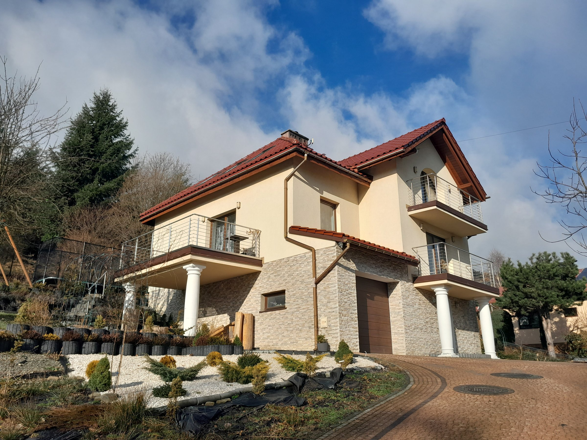

# Dom w Mesznej — Marketing Website

Editorial marketing site for a 402 m² property in Meszna, Beskid Śląski, Poland.
**Direct sale from owner** — no agency, no broker fees.



**Stack:** Next.js 16 (App Router) · React 19 · TypeScript 5.9 · Tailwind CSS v4 · GSAP 3 · next-themes · lucide-react
**Fonts:** `next/font/google` — Cormorant Garamond (display), Inter Tight (sans), JetBrains Mono (mono)
**Hosting:** Netlify (`@netlify/plugin-nextjs`, Netlify Forms)

> Tailwind v4 is configured CSS-first — the theme lives in the `@theme` block in
> [app/globals.css](app/globals.css) and there is **no `tailwind.config.js`**.
> PostCSS loads it through `@tailwindcss/postcss` ([postcss.config.js](postcss.config.js)).
> ESLint uses the flat config in [eslint.config.mjs](eslint.config.mjs).

---

## Struktura projektu

```
dom-meszna/
├── app/
│   ├── layout.tsx
│   ├── page.tsx
│   ├── globals.css
│   ├── icon.svg
│   ├── opengraph-image.tsx
│   ├── robots.ts
│   ├── sitemap.ts
│   └── polityka-prywatnosci/
│       └── page.tsx
├── components/
│   ├── Header.tsx
│   ├── Preloader.tsx
│   ├── introGate.ts
│   ├── Hero.tsx
│   ├── Marquee.tsx
│   ├── Stats.tsx
│   ├── Statement.tsx
│   ├── Gallery.tsx
│   ├── Potential.tsx
│   ├── Showcase.tsx
│   ├── Floorplan.tsx
│   ├── Location.tsx
│   ├── Interior.tsx
│   ├── Plans.tsx
│   ├── Pricing.tsx
│   ├── Contact.tsx
│   ├── Footer.tsx
│   ├── SmoothScroll.tsx
│   ├── ThemeProvider.tsx
│   ├── Arrow.tsx
│   ├── useSectionAnim.ts
│   ├── " StructuredData.tsx"
│   └── consent/
│       ├── ConsentBanner.tsx
│       ├── ConsentLink.tsx
│       ├── Analytics.tsx
│       ├── consentStore.ts
│       └── useConsent.ts
├── public/
│   ├── __forms.html
│   ├── google03d00cf0bb91c15c.html
│   └── images/
│       ├── house/
│       ├── interior/
│       ├── plans/
│       └── landscape/beskidy.jpg
├── netlify.toml
├── next.config.js
├── postcss.config.js
├── eslint.config.mjs
├── .env.example
└── package.json
```

---

## Property data

- **Cena:** 1 899 000 zł (4 720 zł/m²) · bez pośredników
- **Powierzchnia:** 402,35 m² (170,75 m² użytkowej) · działka 1 600 m²
- **Pokoje:** 7 · kondygnacje: 3 · rok: 2018 · Architekt: Studio Atrium
- **Adres:** Meszna, gmina Wilkowice
- **Kontakt:** dommeszna@proton.me

---

## Analytics i zgody

Analityka jest **domyślnie wyłączona**. Bez `NEXT_PUBLIC_GA_ID` strona nie wysyła
żadnych żądań do zewnętrznych serwisów, a baner zgody się nie pokazuje — nie ma
na co wyrażać zgody.

```bash
cp .env.example .env.local
# NEXT_PUBLIC_GA_ID=G-XXXXXXXXXX  → włącza baner i (po zgodzie) GA4
```

Skrypt Google ładuje się dopiero po aktywnej zgodzie ([components/consent/Analytics.tsx](components/consent/Analytics.tsx)).

---

## Formularz kontaktowy

Formularz obsługuje **Netlify Forms**. Schemat formularza musi istnieć jako statyczny
HTML — dlatego [public/__forms.html](public/__forms.html) (wymagane przez
`@netlify/plugin-nextjs` v5+). Formularz użytkownika w
[components/Contact.tsx](components/Contact.tsx) wysyła `POST` na `/__forms.html`
przez `fetch`. Zmiana pól formularza wymaga aktualizacji **obu** plików.

---

## Komendy

```bash
npm install
npm run dev          # Server deweloperski
npm run build        # Production build
npm start            # Uruchom production build lokalnie
npm run lint         # ESLint (flat config)
```
